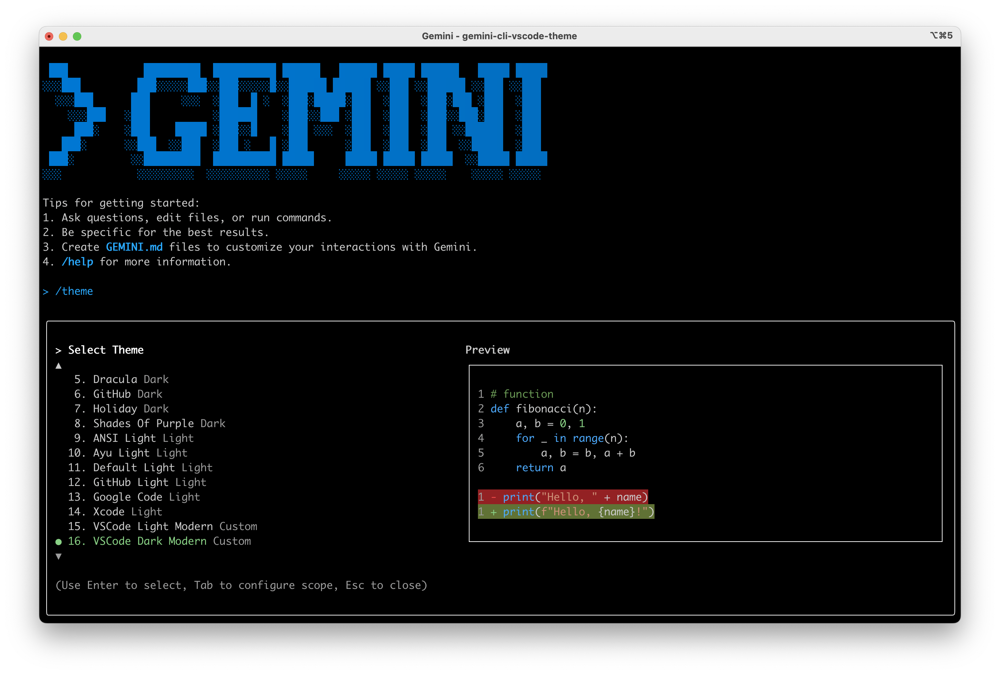
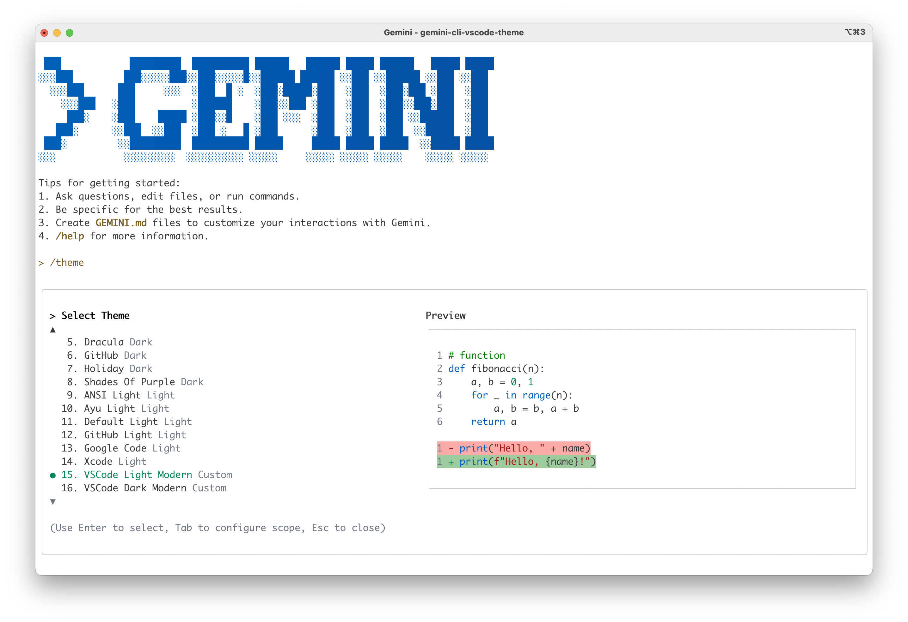

# Gemini CLI Themes (VSCode Modern Ports)

This repository provides two custom themes for the Gemini CLI, ported from the popular VSCode Light Modern and Dark Modern themes.

## Previews

### VSCode Dark Modern (Gemini CLI Port)



### VSCode Light Modern (Gemini CLI Port)



## Installation

There are two ways to install these themes. The recommended method allows you to easily switch between them using the `/theme` command in Gemini CLI.

### Recommended Method: Add to `settings.json`

This method adds the themes to your Gemini CLI settings, making them selectable with the `/theme` command.

1.  **Locate your Gemini settings file:** It's usually at `~/.gemini/settings.json`.
2.  **Copy the theme definitions:** Open the `settings.json` file from this repository. Copy the entire `"ui"` object.
3.  **Update your settings:** Paste the copied `"ui"` object into your `~/.gemini/settings.json` file. If you already have a `"ui"` section, merge the contents.

> **Tip:** If your `~/.gemini/settings.json` is empty, you can just copy the `settings.json` file from this repository to `~/.gemini/`.

### Alternative Method: Load Theme from File

This method loads a single theme directly from the file path.

1.  **Clone this repository:**
    ```bash
    git clone https://github.com/ysheng26/gemini-cli-vscode-theme.git
    ```
2.  **Update Gemini settings:**
    In your `~/.gemini/settings.json`, point the `theme` property to the absolute path of your desired theme file.

    For the light theme:
    ```json
    {
      "ui": {
        "theme": "/path/to/gemini-cli-vscode-theme/vscode-light-modern.json"
      }
    }
    ```

    For the dark theme:
    ```json
    {
      "ui": {
        "theme": "/path/to/gemini-cli-vscode-theme/vscode-dark-modern.json"
      }
    }
    ```
    > **Note:** With this method, you won't be able to switch themes using the `/theme` command. You'll need to edit the path in `settings.json` manually.

## Switching Themes

If you used the **Recommended Method**, you can easily switch between the light and dark themes:

1.  Run the `/theme` command in the Gemini CLI.
2.  Select either `vscode-light-modern` or `vscode-dark-modern` from the list.

